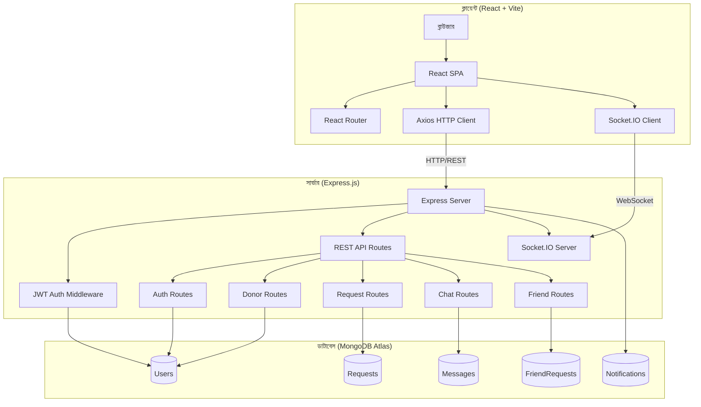
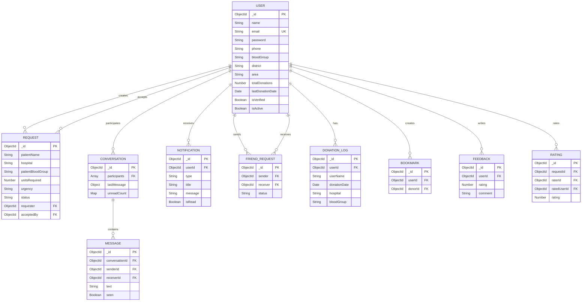
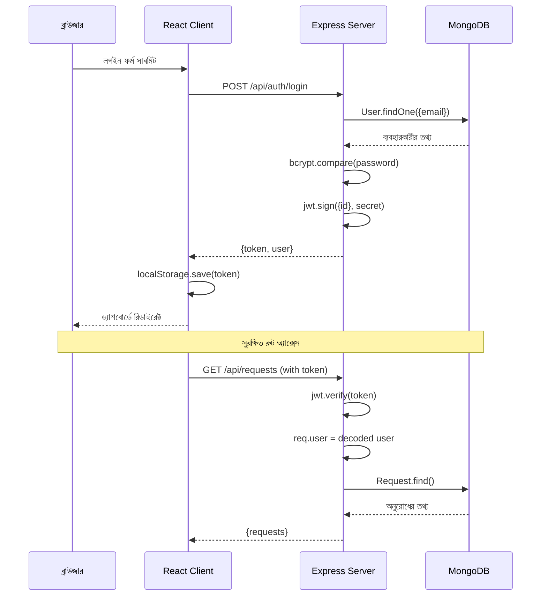
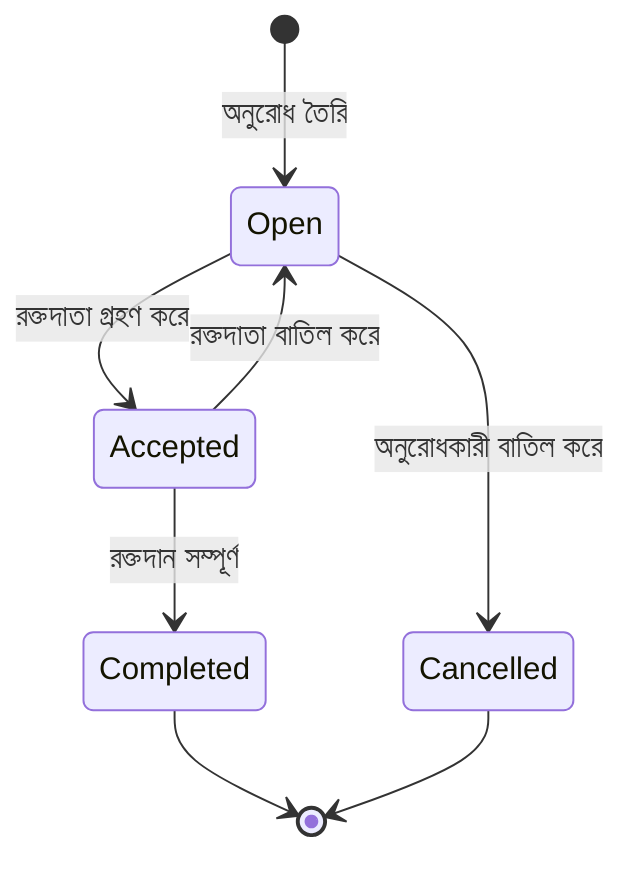
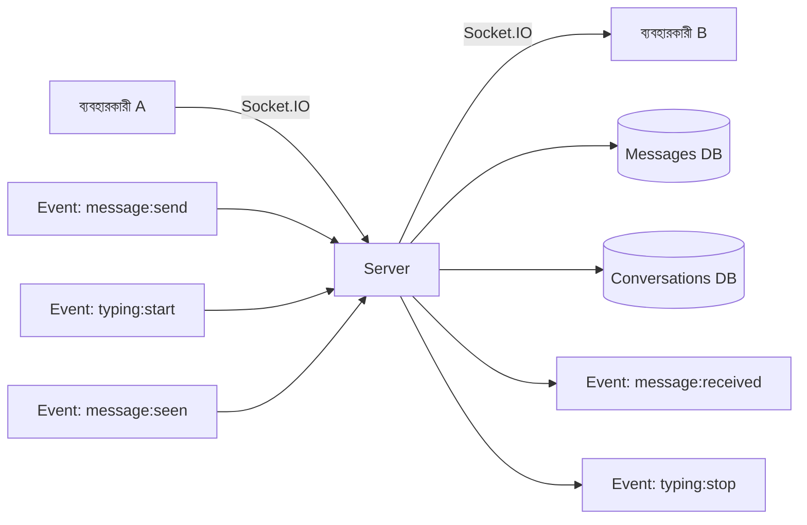
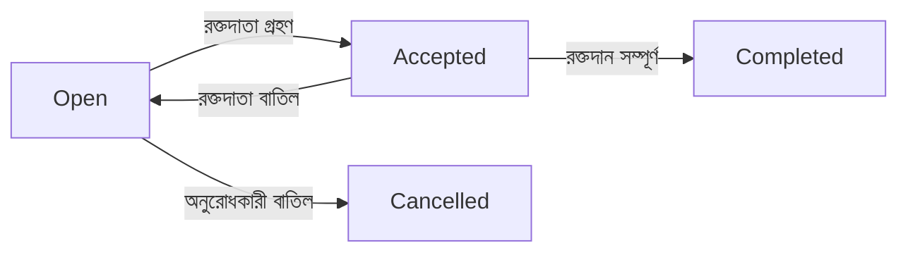
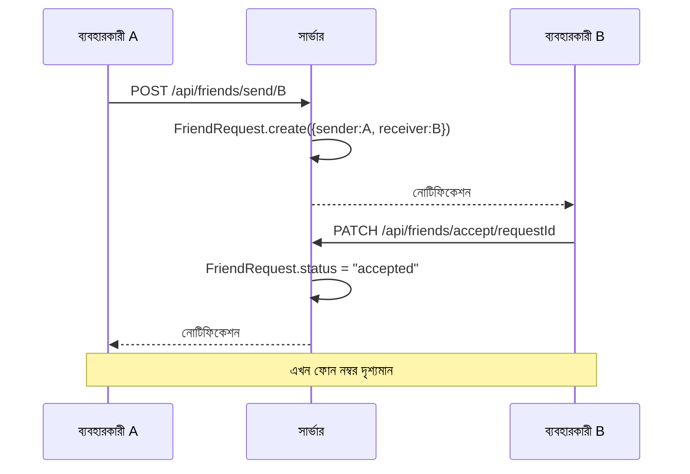

# BloodDrop – রক্তদান ব্যবস্থাপনা সিস্টেম

---

<div align="center">

## ডিপ্লোমা ইন কম্পিউটার সাইন্স ও প্রকৌশল
## চূড়ান্ত প্রকল্প প্রতিবেদন

---

### **BloodDrop – Blood Donation Management System**
### **ব্লাডড্রপ – রক্তদান ব্যবস্থাপনা সিস্টেম**

---

**রাজশাহী পলিটেকনিক ইনস্টিটিউট**

---

**প্রকল্প পরিচালক:**
MD. Eshtiak Ahmed

**প্রকল্প টিম:**
| ক্রমিক | নাম | ভূমিকা |
|---------|------|--------|
| ১ | MD. Eshtiak Ahmed | প্রধান উন্নয়নকারী (Lead Developer) |
| ২ | Md Towfiqur Rahman | সহ-উন্নয়নকারী |
| ৩ | Abdur Rahman | সহ-উন্নয়নকারী |
| ৪ | Sabbir Ahmed | সহ-উন্নয়নকারী |
| ৫ | Al Yeamin Abir | সহ-উন্নয়নকারী |

---

**পর্যবেক্ষক/উপদেষ্টা:** [উপদেষ্টার নাম]

**তারিখ:** জুলাই ২০২৬

---


</div>

---

## সূচিপত্র (Table of Contents)

1. [সারসংক্ষেপ (Abstract)](#১-সারসংক্ষেপ-abstract)
2. [ভূমিকা (Introduction)](#২-ভূমিকা-introduction)
3. [সমস্যা বিবরণ (Problem Statement)](#৩-সমস্যা-বিবরণ-problem-statement)
4. [প্রকল্পের উদ্দেশ্য (Objectives)](#৪-প্রকল্পের-উদ্দেশ্য-objectives)
5. [বৈশিষ্ট্যসমূহ (Features)](#৫-বৈশিষ্ট্যসমূহ-features)
6. [সিস্টেম বিশ্লেষণ (System Analysis)](#৬-সিস্টেম-বিশ্লেষণ-system-analysis)
7. [সিস্টেম ডিজাইন (System Design)](#৭-সিস্টেম-ডিজাইন-system-design)
8. [ব্যবহৃত প্রযুক্তি (Technologies Used)](#৮-ব্যবহৃত-প্রযুক্তি-technologies-used)
9. [বাস্তবায়ন বিবরণ (Implementation Details)](#৯-বাস্তবায়ন-বিবরণ-implementation-details)
10. [ফোল্ডার কাঠামো (Folder Structure)](#১০-ফোল্ডার-কাঠামো-folder-structure)
11. [পরীক্ষা-নিরীক্ষা (Testing)](#১১-পরীক্ষা-নিরীক্ষা-testing)
12. [চ্যালেঞ্জ ও সীমাবদ্ধতা (Challenges & Limitations)](#১২-চ্যালেঞ্জ-ও-সীমাবদ্ধতা-challenges--limitations)
13. [ভবিষ্যৎ উন্নয়ন (Future Improvements)](#১৩-ভবিষ্যৎ-উন্নয়ন-future-improvements)
14. [উপসংহার (Conclusion)](#১৪-উপসংহার-conclusion)
15. [গ্রন্থপঞ্জি (References)](#১৫-গ্রন্থপঞ্জি-references)

---

## ১. সারসংক্ষেপ (Abstract)

বাংলাদেশে রক্তদানের জন্য বর্তমানে কোনো সুষ্ঠু ও কার্যকর ডিজিটাল প্ল্যাটফর্ম নেই। জরুরি রক্তের প্রয়োজনে মানুষেরা মূলত ফেসবুক গ্রুপ, মুখে মুখে প্রচার বা ব্যক্তিগত পরিচিতির ওপর নির্ভর করে। এই পদ্ধতিতে সময়মতো রক্ত পাওয়া কঠিন, রক্তদাতার তথ্য যাচাই করা যায় না এবং কোনো ধরনের যোগাযোগ বা ট্র্যাকিং সুবিধা নেই।

**BloodDrop** একটি আধুনিক ওয়েব-ভিত্তিক রক্তদান ব্যবস্থাপনা সিস্টেম যা রক্তদাতা ও রক্তপ্রাপকদের মধ্যে সেতুবন্ধন তৈরি করে। এই সিস্টেমে রক্তদাতাদের সন্ধান, রক্তের অনুরোধ, রিয়েল-টাইম চ্যাট, কানেকশন সিস্টেম, গেমিফিকেশন (XP ও র‍্যাংক), এবং ইমেইল নোটিফিকেশন অন্তর্ভুক্ত রয়েছে।

প্রকল্পটি **React.js** (ফ্রন্টএন্ড), **Express.js** (ব্যাকএন্ড), **MongoDB Atlas** (ডাটাবেস), এবং **Socket.IO** (রিয়েল-টাইম যোগাযোগ) ব্যবহার করে তৈরি করা হয়েছে। সিস্টেমটি Vercel ও Render-এ ডিপ্লয় করা হয়েছে এবং বাংলাদেশের ১৫টি জেলায় ১৫০+ ডেমো রক্তদাতার ডেটা অন্তর্ভুক্ত রয়েছে।

মূল বৈশিষ্ট্যগুলোর মধ্যে রয়েছে: জিওলোকেশন-ভিত্তিক রক্তদাতা অনুসন্ধান, রক্তের ধরন অনুযায়ী সার্চ, প্রোফাইল যাচাইকরণ, রিয়েল-টাইম চ্যাট ও টাইপিং ইন্ডিকেটর, বন্ধু সংযোগ সিস্টেম, এবং রক্তদান ট্র্যাকিং সিস্টেম।

**শব্দকোষ:** রক্তদান, রক্তদাতা ব্যবস্থাপনা, React.js, MongoDB, Socket.IO, রিয়েল-টাইম চ্যাট, জিওলোকেশন।

---

## ২. ভূমিকা (Introduction)

### ২.১ পটভূমি

রক্তদান মানবজীবনের অন্যতম গুরুত্বপূর্ণ অংশ। প্রতিদিন বাংলাদেশে হাজার হাজার মানুষের রক্তের প্রয়োজন হয় — দুর্ঘটনা, অস্ত্রোপচার, রক্তাল্পতা, ক্যান্সার চিকিৎসা এবং বিভিন্ন জটিল রোগের চিকিৎসায়। তবে সঠিক সময়ে সঠিক রক্তের ধরনের রক্ত পাওয়া একটি বড় চ্যালেঞ্জ।

বর্তমানে বাংলাদেশে রক্তের জন্য মানুষেরা মূলত নিম্নলিখিত পদ্ধতিতে নির্ভর করে:

1. **ফেসবুক গ্রুপ:** বিভিন্ন ফেসবুক গ্রুপে পোস্ট করে রক্তদাতার সন্ধান করা।
2. **মুখে মুখে প্রচার:** পরিচিতদের মাধ্যমে রক্তদাতার খোঁজ করা।
3. **সরাসরি হাসপাতালে যাওয়া:** হাসপাতালে গিয়ে রক্তদাতার সন্ধান করা।

এই পদ্ধতিগুলো অত্যন্ত অকার্যকর এবং এতে অনেক সময় অপচয় হয়। জরুরি পরিস্থিতিতে সঠিক সময়ে রক্ত না পাওয়ায় অনেকে প্রাণ হারাচ্ছেন।

### ২.২ প্রকল্পের ধারণা

**BloodDrop** সিস্টেমটি এই সমস্যার সমাধানে একটি আধুনিক ডিজিটাল প্ল্যাটফর্ম হিসেবে কাজ করে। এটি একটি ফুল-স্ট্যাক ওয়েব অ্যাপ্লিকেশন যা:

- রক্তদাতাদের একটি কেন্দ্রীয় ডাটাবেসে সংরক্ষণ করে
- রক্তের অনুরোধ তৈরি ও ব্যবস্থাপনা করে
- রিয়েল-টাইম চ্যাটের মাধ্যমে যোগাযোগ সহজ করে
- জিওলোকেশন ব্যবহার করে কাছের রক্তদাতা খুঁজে বের করে
- রক্তদাতাদের অংশগ্রহণ গেমিফাই করে

### ২.৩ প্রকল্পের সীমা

এই সিস্টেমটি মূলত বাংলাদেশের প্রেক্ষাপটে ডিজাইন করা হয়েছে। এতে বাংলাদেশের ১৫টি প্রধান জেলার রক্তদাতার ডেটা অন্তর্ভুক্ত রয়েছে এবং বাংলাদেশের ফোন নম্বর ফরম্যাট (01XXXXXXXXX) সমর্থন করে।

---

## ৩. সমস্যা বিবরণ (Problem Statement)

### ৩.১ বর্তমান সমস্যা

বাংলাদেশে রক্তদান ব্যবস্থাপনায় নিম্নলিখিত সমস্যাগুলো বিদ্যমান:

| ক্রমিক | সমস্যা | বিবরণ |
|---------|--------|--------|
| ১ | কেন্দ্রীয় ডাটাবেসের অভাব | রক্তদাতাদের কোনো সুষ্ঠু ডাটাবেস নেই |
| ২ | তথ্য যাচাইয়ের অভাব | ফেসবুকে পোস্ট করা তথ্য সত্য কিনা তা যাচাই করা যায় না |
| ৩ | ধীর প্রক্রিয়া | রক্তের জন্য অনুরোধ করলে ঘণ্টার পর ঘণ্টা অপেক্ষা করতে হয় |
| ৪ | যোগাযোগের অভাব | রক্তদাতা ও রক্তপ্রাপকের মধ্যে সরাসরি যোগাযোগের সুবিধা নেই |
| ৫ | জিওলোকেশন সুবিধার অভাব | কাছের রক্তদাতা খুঁজে বের করার কোনো উপায় নেই |
| ৬ | রক্তদান ট্র্যাকিংয়ের অভাব | কে কতবার রক্তদান করেছে তার কোনো হিসাব নেই |
| ৭ | রিয়েল-টাইম যোগাযোগের অভাব | জরুরি পরিস্থিতিতে তাৎক্ষণিক যোগাযোগের সুবিধা নেই |

### ৩.২ প্রস্তাবিত সমাধান

BloodDrop সিস্টেমটি এই সমস্যাগুলোর সমাধানে নিম্নলিখিত পদ্ধতি প্রস্তাব করে:

1. **কেন্দ্রীয় ডাটাবেস:** MongoDB Atlas-এ সকল রক্তদাতার তথ্য সংরক্ষণ
2. **যাচাইকৃত প্রোফাইল:** ইমেইল ভিত্তিক নিবন্ধন ও প্রোফাইল যাচাইকরণ
3. **স্বয়ংক্রিয় অনুসন্ধান:** রক্তের ধরন ও জেলা অনুযায়ী স্বয়ংক্রিয় সার্চ
4. **রিয়েল-টাইম চ্যাট:** Socket.IO ব্যবহার করে তাৎক্ষণিক যোগাযোগ
5. **জিওলোকেশন:** Haversine Formula ব্যবহার করে কাছের রক্তদাতা খোঁজা
6. **গেমিফিকেশন:** XP ও র‍্যাংক সিস্টেমের মাধ্যমে রক্তদাতাদের উৎসাহিত করা

---

## ৪. প্রকল্পের উদ্দেশ্য (Objectives)

এই প্রকল্পের প্রধান উদ্দেশ্যগুলো হলো:

1. **কেন্দ্রীয় রক্তদাতা ডাটাবেস তৈরি করা** — বাংলাদেশের রক্তদাতাদের একটি সুষ্ঠু ডাটাবেস তৈরি করা যাতে রক্তের প্রয়োজনে দ্রুত রক্তদাতা খুঁজে পাওয়া যায়।

2. **রক্তের অনুরোধ ব্যবস্থাপনা সহজ করা** — রক্তপ্রাপকদের সহজেই রক্তের অনুরোধ তৈরি করতে এবং রক্তদাতাদের সেই অনুরোধ গ্রহণ করতে সক্ষম করা।

3. **রিয়েল-টাইম যোগাযোগ প্রদান করা** — রক্তদাতা ও রক্তপ্রাপকের মধ্যে তাৎক্ষণিক চ্যাট ও যোগাযোগের সুবিধা প্রদান করা।

4. **জিওলোকেশন-ভিত্তিক অনুসন্ধান বাস্তবায়ন করা** — Haversine Formula ব্যবহার করে ব্যবহারকারীর অবস্থানের কাছের রক্তদাতা খুঁজে বের করা।

5. **রক্তদান ট্র্যাকিং ও গেমিফিকেশন প্রদান করা** — রক্তদাতাদের রক্তদানের ইতিহাস ট্র্যাক করা এবং XP ও র‍্যাংক সিস্টেমের মাধ্যমে তাদের উৎসাহিত করা।

6. **নিরাপদ ও ব্যবহারকারী-বান্ধব প্ল্যাটফর্ম তৈরি করা** — JWT অথেনটিকেশন, পাসওয়ার্ড হ্যাশিং, এবং ইনপুট ভ্যালিডেশনের মাধ্যমে নিরাপদ একটি প্ল্যাটফর্ম তৈরি করা।

---

## ৫. বৈশিষ্ট্যসমূহ (Features)

### ৫.১ মডিউলভিত্তিক বৈশিষ্ট্য তালিকা

#### মডিউল ১: ব্যবহারকারী ব্যবস্থাপনা (Authentication & User Management)

| বৈশিষ্ট্য | বিবরণ |
|-----------|--------|
| নিবন্ধন (Registration) | ইমেইল, পাসওয়ার্ড, নাম, ফোন, রক্তের ধরন, জেলা দিয়ে নিবন্ধন |
| লগইন (Login) | ইমেইল ও পাসওয়ার্ড দিয়ে লগইন |
| প্রোফাইল আপডেট | নাম, ফোন, জেলা, এলাকা, ছবি, বায়ো সম্পাদনা |
| পাসওয়ার্ড নিরাপত্তা | bcrypt দিয়ে ১২ সাল্ট রাউন্ডে হ্যাশিং |
| JWT অথেনটিকেশন | স্টেটলেস টোকেন ভিত্তিক অথেনটিকেশন (৭ দিনের মেয়াদ) |

#### মডিউল ২: রক্তদাতা ব্যবস্থাপনা (Donor Management)

| বৈশিষ্ট্য | বিবরণ |
|-----------|--------|
| রক্তদাতা অনুসন্ধান | রক্তের ধরন, জেলা, এলাকা অনুযায়ী ফিল্টারিং |
| জিওলোকেশন সার্চ | Haversine Formula ব্যবহার করে কাছের রক্তদাতা খোঁজা |
| প্রোফাইল দেখা | রক্তদাতার সম্পূর্ণ প্রোফাইল দেখা |
| বুকমার্ক | পছন্দের রক্তদাতাদের সংরক্ষণ করা |
| লিডারবোর্ড | সর্বোচ্চ রক্তদানকারীদের তালিকা |

#### মডিউল ৩: রক্তের অনুরোধ (Blood Request System)

| বৈশিষ্ট্য | বিবরণ |
|-----------|--------|
| অনুরোধ তৈরি | রোগীর নাম, হাসপাতাল, রক্তের ধরন, জরুরি মাত্রা দিয়ে অনুরোধ |
| অনুরোধ স্বীকার | রক্তদাতা অনুরোধ গ্রহণ করতে পারেন |
| অনুরোধ সম্পূর্ণ | রক্তদান সম্পূর্ণ হলে মার্ক করা |
| ম্যাচিং নোটিফিকেশন | মিলিয়ে যাওয়া রক্তের ধরনের ব্যবহারকারীদের ইমেইল পাঠানো |
| স্ট্যাটাস ট্র্যাকিং | অনুরোধের অবস্থা (open/accepted/completed/cancelled) ট্র্যাক করা |

#### মডিউল ৪: রিয়েল-টাইম চ্যাট (Real-Time Chat)

| বৈশিষ্ট্য | বিবরণ |
|-----------|--------|
| ১-টু-১ চ্যাট | ব্যবহারকারীদের মধ্যে সরাসরি চ্যাট |
| অনলাইন স্ট্যাটাস | ব্যবহারকারী অনলাইনে আছে কিনা তা দেখানো |
| টাইপিং ইন্ডিকেটর | অন্য ব্যবহারকারী টাইপ করছে কিনা তা দেখানো |
| রিড রিসিট | মেসেজ পড়া হয়েছে কিনা তা জানানো (ডাবল চেকমার্ক) |
| ইমেজ শেয়ারিং | 2MB পর্যন্ত ছবি পাঠানো |
| ইমোজি পিকার | ১০০+ ইমোজি সমর্থন |
| মেসেজ ডিলিট | নিজের পাঠানো মেসেজ ডিলিট করা |

#### মডিউল ৫: কানেকশন সিস্টেম (Connection System)

| বৈশিষ্ট্য | বিবরণ |
|-----------|--------|
| কানেকশন রিকোয়েস্ট | অন্য ব্যবহারকারীকে কানেকশন রিকোয়েস্ট পাঠানো |
| গ্রহণ/প্রত্যাখ্যান | কানেকশন রিকোয়েস্ট গ্রহণ বা প্রত্যাখ্যান করা |
| ফোন নম্বর প্রকাশ | কানেকশন গ্রহণের পর ফোন নম্বর দেখা |
| নোটিফিকেশন | কানেকশন রিকোয়েস্টের নোটিফিকেশন |

#### মডিউল ৬: গেমিফিকেশন ও ট্র্যাকিং (Gamification & Tracking)

| বৈশিষ্ট্য | বিবরণ |
|-----------|--------|
| XP সিস্টেম | রক্তদানের সংখ্যার ওপর ভিত্তি করে XP |
| র‍্যাংক সিস্টেম | Recruit → Healer → Knight → Champion → Hero → Legend |
| লিডারবোর্ড | সর্বোচ্চ রক্তদানকারীদের র‍্যাংকিং |
| রেটিং সিস্টেম | রক্তদানের পর অন্য ব্যবহারকারীকে রেটিং দেওয়া |
| ফিডব্যাক | ব্যবহারকারীদের মতামত ও রিভিউ |
| ডোনেশন লগ | রক্তদানের ইতিহাস ট্র্যাক করা |

---

## ৬. সিস্টেম বিশ্লেষণ (System Analysis)

### ৬.১ সাধারণ সাংগঠনিক বিশ্লেষণ

BloodDrop সিস্টেমটি তিনটি প্রধান স্তরে বিভক্ত:

1. **প্রেজেন্টেশন স্তর (Presentation Tier):** React.js-ভিত্তিক ফ্রন্টএন্ড যা ব্যবহারকারীর সাথে ইন্টারঅ্যাক্ট করে।
2. **ব্যবসায়িক যুক্তি স্তর (Business Logic Tier):** Express.js-ভিত্তিক ব্যাকএন্ড যা API রিকোয়েস্ট প্রসেস করে।
3. **ডাটা স্তর (Data Tier):** MongoDB Atlas ডাটাবেস যা সকল ডেটা সংরক্ষণ করে।

### ৬.২ হার্ডওয়্যার প্রয়োজনীয়তা

| উপাদান | ন্যূনতম | সুপারিশ |
|---------|---------|---------|
| প্রসেসর | Intel Core i3 | Intel Core i5 বা তার উপর |
| RAM | 4 GB | 8 GB বা তার উপর |
| স্টোরেজ | 256 GB SSD | 512 GB SSD |
| ইন্টারনেট | 2 Mbps | 5 Mbps বা তার উপর |
| ডিসপ্লে | 1366x768 | 1920x1080 বা তার উপর |

### ৬.৩ সফটওয়্যার প্রয়োজনীয়তা

| সফটওয়্যার | ব্যবহার |
|-------------|---------|
| Node.js (v18+) | JavaScript রানটাইম |
| MongoDB Atlas | ক্লাউড ডাটাবেস |
| Vite | ফ্রন্টএন্ড বিল্ড টুল |
| VS Code | কোড এডিটর |
| Git | ভার্সন কন্ট্রোল |
| Postman | API টেস্টিং |

### ৬.৪ ব্যবহারকারীর ধরন

| ব্যবহারকারীর ধরন | বৈশিষ্ট্য |
|------------------|-----------|
| অতিথি (Guest) | ল্যান্ডিং পেজ, ডোনার সার্চ, লিডারবোর্ড দেখতে পারে |
| নিবন্ধিত ব্যবহারকারী | সকল বৈশিষ্ট্য ব্যবহার করতে পারে |
| অ্যাডমিন | প্ল্যাটফর্ম ব্যবস্থাপনা, ব্যবহারকারী যাচাইকরণ |

---

## ৭. সিস্টেম ডিজাইন (System Design)

### ৭.১ সিস্টেম আর্কিটেকচার



### ৭.২ ডাটাবেস সম্পর্ক চিত্র (ER Diagram)



### ৭.৩ অথেনটিকেশন ফ্লো



### ৭.৪ রক্তের অনুরোধ জীবনচক্র



### ৭.৫ রিয়েল-টাইম চ্যাট আর্কিটেকচার



---

## ৮. ব্যবহৃত প্রযুক্তি (Technologies Used)

### ৮.১ প্রযুক্তি তালিকা

| ক্রমিক | প্রযুক্তি | সংস্করণ | ব্যবহার |
|---------|----------|---------|--------|
| ১ | React.js | 19.2.7 | ফ্রন্টএন্ড UI ফ্রেমওয়ার্ক |
| ২ | Vite | 8.1.1 | বিল্ড টুল ও ডেভেলপমেন্ট সার্ভার |
| ৩ | React Router | 7.18.1 | ক্লায়েন্ট-সাইড রাউটিং |
| ৪ | Axios | 1.18.1 | HTTP ক্লায়েন্ট |
| ৫ | Socket.IO Client | 4.8.3 | WebSocket ক্লায়েন্ট |
| ৬ | React Query | 5.101.2 | সার্ভার স্টেট ক্যাশিং |
| ৭ | React Hot Toast | 2.6.0 | টোস্ট নোটিফিকেশন |
| ৮ | Lucide React | 1.23.0 | আইকন লাইব্রেরি |
| ৯ | Express.js | 4.21.2 | ব্যাকএন্ড ফ্রেমওয়ার্ক |
| ১০ | Mongoose | 8.9.5 | MongoDB ODM |
| ১১ | Socket.IO | 4.8.3 | WebSocket সার্ভার |
| ১২ | jsonwebtoken | 9.0.2 | JWT অথেনটিকেশন |
| ১৩ | bcryptjs | 3.0.3 | পাসওয়ার্ড হ্যাশিং |
| ১৪ | Helmet | 8.0.0 | HTTP সুরক্ষা হেডার |
| ১৫ | CORS | 2.8.5 | Cross-Origin রিসোর্স শেয়ারিং |
| ১৬ | Resend | 6.17.2 | ইমেইল পাঠানো |
| ১৭ | MongoDB Atlas | M0 (Free) | ক্লাউড ডাটাবেস |
| ১৮ | Vercel | - | ফ্রন্টএন্ড হোস্টিং |
| ১৯ | Render | - | ব্যাকএন্ড হোস্টিং |
| ২০ | Tailwind CSS | - | ইউটিলিটি-ফার্স্ট CSS |

### ৮.২ প্রযুক্তি নির্বাচনের যুক্তি

**React.js:** কম্পোনেন্ট-ভিত্তিক আর্কিটেকচার, বড় ইকোসিস্টেম, এবং ডেভেলপার কমিউনিটির সমর্থন। ভার্চুয়াল DOM ব্যবহার করে হাই পারফর্ম্যান্স UI তৈরি করে।

**Express.js:** সহজ ও নমনীয় মাইক্রো-ফ্রেমওয়ার্ক। middleware সিস্টেমের মাধ্যমে সুরক্ষা, ভ্যালিডেশন ও এরর হ্যান্ডলিং সহজে বাস্তবায়ন করা যায়।

**MongoDB Atlas:** NoSQL ডাটাবেস যা ফ্লেক্সিবল স্কিমা প্রদান করে। ক্লাউড-হোস্টেড হওয়ায় সার্ভার ম্যানেজমেন্টের প্রয়োজন নেই।

**Socket.IO:** রিয়েল-টাইম দ্বিমুখী যোগাযোগের জন্য। WebSocket-এর উপর অটোমেটিক ফলব্যাক সহ।

**Vite:** দ্রুত HMR (Hot Module Replacement) এবং অপ্টিমাইজড বিল্ড।

---

## ৯. বাস্তবায়ন বিবরণ (Implementation Details)

### ৯.১ ল্যান্ডিং পেজ (Landing Page)

**পাথ:** `/`

ল্যান্ডিং পেজটি সিস্টেমের প্রথম পৃষ্ঠা যা ব্যবহারকারীদের সিস্টেম পরিচিত করে। এতে অন্তর্ভুক্ত রয়েছে:

- **হিরো সেকশন:** অটো-রোটেটিং ৪টি ব্যানার ইমেজ
- **স্ট্যাটস কাউন্টার:** API থেকে রিয়েল স্ট্যাটস (মোট ব্যবহারকারী, রক্তদান, অনুরোধ)
- **কিভাবে কাজ করে:** ৩টি ধাপের কার্ড (নিবন্ধন → খুঁজুন → রক্তদান করুন)
- **রক্তের ধরন কম্প্যাটিবিলিটি চার্ট:** ৮x৮ ইন্টারেক্টিভ ম্যাট্রিক্স
- **বৈশিষ্ট্য কার্ড:** ৬টি ফিচার কার্ড ৩D ইফেক্ট সহ
- **প্রশংসাপত্র:** ব্যবহারকারীদের রিভিউ
- **FAQ:** সচরাচর জিজ্ঞাসা

```jsx
// ল্যান্ডিং পেজের রক্তের ধরন কম্প্যাটিবিলিটি ম্যাট্রিক্স
const COMPATIBILITY = {
  "O-":  { donateTo: ["O-","O+","A-","A+","B-","B+","AB-","AB+"], receiveFrom: ["O-"] },
  "O+":  { donateTo: ["O+","A+","B+","AB+"], receiveFrom: ["O-","O+"] },
  // ... অন্যান্য রক্তের ধরন
};
```

**[স্ক্রিনশট: ল্যান্ডিং পেজ]**

### ৯.২ রক্তদাতা অনুসন্ধান পেজ (Donor Search Page)

**পাথ:** `/donors`

এই পেজটি রক্তদাতাদের খুঁজে বের করার প্রধান পৃষ্ঠা।

**মূল বৈশিষ্ট্য:**
- রক্তের ধরন, জেলা, এলাকা অনুযায়ী ফিল্টারিং
- জিওলোকেশন-ভিত্তিক অনুসন্ধান (Haversine Formula)
- পেজিনেশন (প্রতি পৃষ্ঠায় ১২টি ফলাফল)
- 3D অ্যানিমেটেড কন্টাক্ট কার্ড
- মডালে সম্পূর্ণ প্রোফাইল

**Haversine Formula:**
```javascript
function haversineDistance(lat1, lng1, lat2, lng2) {
  const R = 6371; // পৃথিবীর ব্যাসার্ধ (কিমি)
  const dLat = (lat2 - lat1) * Math.PI / 180;
  const dLng = (lng2 - lng1) * Math.PI / 180;
  const a = Math.sin(dLat / 2) ** 2 +
    Math.cos(lat1 * Math.PI / 180) * Math.cos(lat2 * Math.PI / 180) *
    Math.sin(dLng / 2) ** 2;
  return R * 2 * Math.atan2(Math.sqrt(a), Math.sqrt(1 - a));
}
```

**[স্ক্রিনশট: রক্তদাতা অনুসন্ধান পেজ]**

### ৯.৩ রক্তের অনুরোধ পেজ (Blood Request Pages)

**পাথ:** `/requests`, `/requests/:id`, `/requests/create`

তিনটি সম্পর্কিত পেজ:

1. **তালিকা পেজ:** সকল রক্তের অনুরোধ দেখা ও ফিল্টার করা
2. **বিস্তারিত পেজ:** অনুরোধের সম্পূর্ণ তথ্য ও কার্যক্রম
3. **তৈরি পেজ:** নতুন রক্তের অনুরোধ তৈরি করা

**অনুরোধের অবস্থা (Status):**


**[স্ক্রিনশট: রক্তের অনুরোধ পেজ]**

### ৯.৪ রিয়েল-টাইম চ্যাট পেজ (Chat Page)

**পাথ:** `/chat`, `/chat/:userId`

চ্যাট পেজটি Socket.IO ব্যবহার করে রিয়েল-টাইম যোগাযোগ প্রদান করে।

**মূল বৈশিষ্ট্য:**
- রেসপন্সিভ লেআউট (ডেস্কটপে সাইডবার + কনভারসেশন)
- অনলাইন স্ট্যাটাস ট্র্যাকিং
- টাইপিং ইন্ডিকেটর
- রিড রিসিট (ডাবল চেকমার্ক)
- ইমেজ শেয়ারিং (২MB সীমা)
- ইমোজি পিকার (১০০+ ইমোজি)

**Socket.IO ইভেন্ট:**
```javascript
// মেসেজ পাঠানো
socket.emit("message:send", { conversationId, text, receiverId });

// মেসেজ গ্রহণ
socket.on("message:received", (message) => { /* ... */ });

// টাইপিং ইন্ডিকেটর
socket.emit("typing:start", { conversationId });
socket.on("typing:stop", { conversationId, userId });
```

**[স্ক্রিনশট: চ্যাট পেজ]**

### ৯.৫ কানেকশন পেজ (Connect Page)

**পাথ:** `/connect`

কানেকশন পেজটি দুটি ট্যাবে বিভক্ত:
1. **পেন্ডিং রিকোয়েস্ট:** আসা কানেকশন রিকোয়েস্ট
2. **আমার কানেকশন:** গৃহীত কানেকশন তালিকা

**কানেকশন প্রক্রিয়া:**


**[স্ক্রিনশট: কানেকশন পেজ]**

### ৯.৬ লিডারবোর্ড পেজ (Leaderboard Page)

**পাথ:** `/leaderboard`

**RPG র‍্যাংক সিস্টেম:**

| র‍্যাংক | প্রয়োজনীয় রক্তদান | বিবরণ |
|---------|-------------------|--------|
| Recruit | ০+ | শুরুর পর্যায় |
| Healer | ১+ | প্রথম রক্তদান |
| Knight | ৫+ | অভিজ্ঞ রক্তদাতা |
| Champion | ৭+ | দক্ষ রক্তদাতা |
| Hero | ১০+ | আদর্শ রক্তদাতা |
| Legend | ১২+ | কিংবদন্তী রক্তদাতা |

**[স্ক্রিনশট: লিডারবোর্ড পেজ]**

### ৯.৭ ড্যাশবোর্ড পেজ (Dashboard Page)

**পাথ:** `/dashboard`

ড্যাশবোর্ড পেজটি ব্যবহারকারীর ব্যক্তিগত হোম পেজ।

**মূল বৈশিষ্ট্য:**
- প্রোফাইল কার্ড (নাম, রক্তের ধরন, জেলা)
- পরিসংখ্যান (মোট রক্তদান, অনুরোধ, কানেকশন)
- রক্তদান লগিং (৯০ দিনের কুলডাউন রিমাইন্ডার)
- সাম্প্রতিক অনুরোধ
- ফিডব্যাক সাবমিশন

**[স্ক্রিনশট: ড্যাশবোর্ড পেজ]**

### ৯.৮ সেটিংস পেজ (Settings Page)

**পাথ:** `/settings`

**মূল বৈশিষ্ট্য:**
- প্রোফাইল ছবি আপলোড (base64)
- নাম, ফোন, জেলা, এলাকা, বায়ো সম্পাদনা
- থিম টগল (ডার্ক/লাইট)
- লগআউট

**[স্ক্রিনশট: সেটিংস পেজ]**

### ৯.৯ API এন্ডপয়েন্ট তালিকা

| মডিউল | পদ্ধতি | এন্ডপয়েন্ট | বিবরণ |
|--------|--------|------------|--------|
| অথ | POST | /api/auth/register | নিবন্ধন |
| অথ | POST | /api/auth/login | লগইন |
| অথ | GET | /api/auth/me | বর্তমান ব্যবহারকারী |
| অথ | PUT | /api/auth/me | প্রোফাইল আপডেট |
| ডোনার | GET | /api/donors/search | রক্তদাতা অনুসন্ধান |
| ডোনার | GET | /api/donors/leaderboard | লিডারবোর্ড |
| ডোনার | GET | /api/donors/:id | রক্তদাতার প্রোফাইল |
| অনুরোধ | GET | /api/requests | সকল অনুরোধ |
| অনুরোধ | POST | /api/requests | অনুরোধ তৈরি |
| অনুরোধ | PATCH | /api/requests/:id/accept | অনুরোধ গ্রহণ |
| অনুরোধ | PATCH | /api/requests/:id/complete | অনুরোধ সম্পূর্ণ |
| অনুরোধ | DELETE | /api/requests/:id | অনুরোধ মুছুন |
| চ্যাট | GET | /api/chat/conversations | কনভারসেশন তালিকা |
| চ্যাট | POST | /api/chat/send | মেসেজ পাঠানো |
| চ্যাট | GET | /api/chat/messages/:id | মেসেজ তালিকা |
| বন্ধু | POST | /api/friends/send/:id | রিকোয়েস্ট পাঠানো |
| বন্ধু | PATCH | /api/friends/accept/:id | রিকোয়েস্ট গ্রহণ |
| বন্ধু | PATCH | /api/friends/reject/:id | রিকোয়েস্ট প্রত্যাখ্যান |
| নোটিফিকেশন | GET | /api/notifications | নোটিফিকেশন তালিকা |
| বুকমার্ক | POST | /api/bookmarks | বুকমার্ক যোগ |
| বুকমার্ক | GET | /api/bookmarks | বুকমার্ক তালিকা |
| ডোনেশন লগ | POST | /api/donation-logs | রক্তদান লগ |
| ফিডব্যাক | POST | /api/feedback | ফিডব্যাক দিন |
| রেটিং | POST | /api/ratings | রেটিং দিন |
| পরিসংখ্যান | GET | /api/stats | প্ল্যাটফর্ম পরিসংখ্যান |

---

## ১০. ফোল্ডার কাঠামো (Folder Structure)

```
Blood Link/
├── Blood-Drop_Server/               # ব্যাকএন্ড সার্ভার
│   ├── config/
│   │   └── db.js                    # MongoDB কানেকশন
│   ├── controllers/
│   │   └── chatController.js        # চ্যাট কন্ট্রোলার
│   ├── middleware/
│   │   ├── auth.js                  # JWT অথেনটিকেশন
│   │   ├── adminAuth.js             # অ্যাডমিন অথেনটিকেশন
│   │   └── errorHandler.js          # গ্লোবাল এরর হ্যান্ডলার
│   ├── models/
│   │   ├── User.js                  # ব্যবহারকারী মডেল
│   │   ├── Request.js               # রক্তের অনুরোধ মডেল
│   │   ├── Conversation.js          # কনভারসেশন মডেল
│   │   ├── Message.js               # মেসেজ মডেল
│   │   ├── Notification.js          # নোটিফিকেশন মডেল
│   │   ├── FriendRequest.js         # বন্ধু রিকোয়েস্ট মডেল
│   │   ├── Bookmark.js              # বুকমার্ক মডেল
│   │   ├── DonationLog.js           # ডোনেশন লগ মডেল
│   │   ├── Feedback.js              # ফিডব্যাক মডেল
│   │   └── Rating.js                # রেটিং মডেল
│   ├── routes/
│   │   ├── auth.js                  # অথ রুট
│   │   ├── donors.js                # ডোনার রুট
│   │   ├── requests.js              # অনুরোধ রুট
│   │   ├── chat.js                  # চ্যাট রুট
│   │   ├── friends.js               # বন্ধু রুট
│   │   ├── notifications.js         # নোটিফিকেশন রুট
│   │   ├── bookmarks.js             # বুকমার্ক রুট
│   │   ├── donationLogs.js          # ডোনেশন লগ রুট
│   │   ├── feedback.js              # ফিডব্যাক রুট
│   │   ├── ratings.js               # রেটিং রুট
│   │   └── stats.js                 # পরিসংখ্যান রুট
│   ├── socket/
│   │   └── index.js                 # Socket.IO ইভেন্ট হ্যান্ডলার
│   ├── utils/
│   │   ├── email.js                 # ইমেইল সার্ভিস (Resend)
│   │   ├── validate.js              # ইনপুট ভ্যালিডেশন
│   │   └── seedDonors.js            # ডেমো ডেটা সিডিং
│   ├── .env                         # এনভায়রনমেন্ট ভেরিয়েবল
│   ├── package.json                 # ডিপেন্ডেন্সি
│   └── server.js                    # মেইন এন্ট্রি পয়েন্ট
│
├── client/                          # ফ্রন্টএন্ড
│   ├── public/
│   │   └── banner*.png              # ব্যানার ইমেজ
│   ├── src/
│   │   ├── components/
│   │   │   ├── chat/                # চ্যাট কম্পোনেন্ট
│   │   │   │   ├── ChatHeader.jsx
│   │   │   │   ├── ChatInput.jsx
│   │   │   │   ├── ChatMessage.jsx
│   │   │   │   ├── ConversationList.jsx
│   │   │   │   └── EmptyChat.jsx
│   │   │   ├── layout/
│   │   │   │   ├── Navbar.jsx
│   │   │   │   └── Footer.jsx
│   │   │   └── ui/
│   │   │       ├── LoadingAnimation.jsx
│   │   │       └── Pagination.jsx
│   │   ├── context/
│   │   │   ├── AuthContext.jsx      # অথ কনটেক্সট
│   │   │   ├── ChatContext.jsx      # চ্যাট কনটেক্সট
│   │   │   └── ThemeContext.jsx     # থিম কনটেক্সট
│   │   ├── data/
│   │   │   ├── constants.js         # ধ্রুবক ও ডেটা
│   │   │   └── donors.json          # ১৫০+ ডেমো ডোনার
│   │   ├── hooks/
│   │   │   └── useSocket.js         # Socket.IO হুক
│   │   ├── pages/
│   │   │   ├── home/
│   │   │   │   └── LandingPage.jsx
│   │   │   ├── donor/
│   │   │   │   ├── DonorSearchPage.jsx
│   │   │   │   └── DonorProfilePage.jsx
│   │   │   ├── blood-request/
│   │   │   │   ├── RequestListPage.jsx
│   │   │   │   ├── RequestDetailPage.jsx
│   │   │   │   └── CreateRequestPage.jsx
│   │   │   ├── chat/
│   │   │   │   └── ChatPage.jsx
│   │   │   ├── connect/
│   │   │   │   └── ConnectPage.jsx
│   │   │   ├── dashboard/
│   │   │   │   └── DashboardPage.jsx
│   │   │   ├── leaderboard/
│   │   │   │   └── LeaderboardPage.jsx
│   │   │   ├── bookmarks/
│   │   │   │   └── BookmarksPage.jsx
│   │   │   ├── admin/
│   │   │   │   └── AdminDashboardPage.jsx
│   │   │   ├── health/
│   │   │   │   └── HealthHubPage.jsx
│   │   │   ├── auth/
│   │   │   │   ├── LoginPage.jsx
│   │   │   │   └── RegisterPage.jsx
│   │   │   └── profile/
│   │   │       ├── ProfilePage.jsx
│   │   │       ├── SettingsPage.jsx
│   │   │       └── NotificationsPage.jsx
│   │   ├── services/
│   │   │   ├── api.js               # Axios ইনস্ট্যান্স
│   │   │   ├── localStore.js        # API ডেটা ফাংশন
│   │   │   ├── friendService.js     # বন্ধু সার্ভিস
│   │   │   └── chatService.js       # চ্যাট সার্ভিস
│   │   ├── styles/
│   │   │   └── index.css            # ৩,১৮৩ লাইন CSS
│   │   ├── utils/
│   │   │   └── validate.js          # ক্লায়েন্ট-সাইড ভ্যালিডেশন
│   │   ├── App.jsx                  # মেইন রুটিং
│   │   └── main.jsx                 # রিয়্যাক্ট এন্ট্রি
│   ├── .env                         # VITE_API_URL
│   ├── package.json
│   └── vite.config.js
│
├── README.md
├── TECHNICAL_DOCUMENTATION.txt
└── vercel.json                      # Vercel ডিপ্লয়মেন্ট
```

---

## ১১. পরীক্ষা-নিরীক্ষা (Testing)

### ১১.১ ফাংশনাল টেস্টিং

| ক্রমিক | টেস্ট কেস | প্রত্যাশিত ফলাফল | আসল ফলাফল | স্ট্যাটাস |
|---------|-----------|------------------|-----------|----------|
| ১ | বৈধ ইমেইল ও পাসওয়ার্ড দিয়ে লগইন | ড্যাশবোর্ডে রিডাইরেক্ট | সফল | ✅ |
| ২ | অবৈধ পাসওয়ার্ড দিয়ে লগইন | এরর টোস্ট দেখায় | সফল | ✅ |
| ৩ | নতুন ব্যবহারকারী নিবন্ধন | সফলভাবে নিবন্ধিত হয় | সফল | ✅ |
| ৪ | ডুপ্লিকেট ইমেইলে নিবন্ধন | এরর টোস্ট দেখায় | সফল | ✅ |
| ৫ | রক্তের ধরন দিয়ে ডোনার সার্চ | মিলিয়ে যাওয়া ডোনার দেখায় | সফল | ✅ |
| ৬ | জিওলোকেশন সার্চ | কাছের ডোনার দেখায় | সফল | ✅ |
| ৭ | রক্তের অনুরোধ তৈরি | অনুরোধ সফলভাবে তৈরি হয় | সফল | ✅ |
| ৮ | অনুরোধ গ্রহণ | স্ট্যাটাস "accepted" হয় | সফল | ✅ |
| ৯ | অনুরোধ সম্পূর্ণ | স্ট্যাটাস "completed" হয় | সফল | ✅ |
| ১০ | রিয়েল-টাইম মেসেজ পাঠানো | মেসেজ তাৎক্ষণিক দৃশ্যমান | সফল | ✅ |
| ১১ | টাইপিং ইন্ডিকেটর | "টাইপ করছে..." দেখায় | সফল | ✅ |
| ১২ | মেসেজ সিন (read receipt) | ডাবল চেকমার্ক দেখায় | সফল | ✅ |
| ১৩ | বন্ধু রিকোয়েস্ট পাঠানো | রিকোয়েস্ট পাঠানো হয় | সফল | ✅ |
| ১৪ | বন্ধু রিকোয়েস্ট গ্রহণ | কানেকশন তৈরি হয় | সফল | ✅ |
| ১৫ | বুকমার্ক যোগ | ডোনার বুকমার্ক হয় | সফল | ✅ |
| ১৬ | বুকমার্ক মুছুন | বুকমার্ক সরিয়ে ফেলা হয় | সফল | ✅ |
| ১৭ | ডোনেশন লগ যোগ | রক্তদানের ইতিহাস সংরক্ষিত হয় | সফল | ✅ |
| ১৮ | ফিডব্যাক সাবমিট | ফিডব্যাক সংরক্ষিত হয় | সফল | ✅ |
| ১৯ | রেটিং সাবমিট | রেটিং সংরক্ষিত হয় | সফল | ✅ |
| ২০ | থিম টগল (ডার্ক/লাইট) | থিম পরিবর্তন হয় | সফল | ✅ |
| ২১ | প্রোফাইল আপডেট | তথ্য সফলভাবে আপডেট হয় | সফল | ✅ |
| ২২ | অনুরোধ মুছুন | অনুরোধ মুছে ফেলা হয় | সফল | ✅ |
| ২৩ | মেসেজ মুছুন | মেসেজ মুছে ফেলা হয় | সফল | ✅ |
| ২৪ | নোটিফিকেশন পড়ুন | নোটিফিকেশন মার্ক হয় | সফল | ✅ |

### ১১.২ UI/UX পরীক্ষা

| ক্রমিক | পরীক্ষার বিষয় | ফলাফল |
|---------|----------------|--------|
| ১ | মোবাইল রেসপন্সিভনেস | সকল পৃষ্ঠা মোবাইলে সঠিকভাবে প্রদর্শিত হয় |
| ২ | ডার্ক মোড | ডার্ক মোডে সকল টেক্সট ও ব্যাকগ্রাউন্ড সঠিক |
| ৩ | 3D কার্ড অ্যানিমেশন | মাউস হোভারে 3D ইফেক্ট কাজ করে |
| ৪ | টোস্ট নোটিফিকেশন | সঠিক সময়ে সঠিক বার্তা প্রদর্শিত হয় |
| ৫ | পেজিনেশন | সঠিকভাবে পৃষ্ঠা পরিবর্তন হয় |
| ৬ | ফর্ম ভ্যালিডেশন | ভুল তথ্যে সঠিক এরর বার্তা দেখায় |

### ১১.৩ নিরাপত্তা পরীক্ষা

| ক্রমিক | পরীক্ষার বিষয় | ফলাফল |
|---------|----------------|--------|
| ১ | পাসওয়ার্ড হ্যাশিং | bcrypt দিয়ে হ্যাশ করা হয়েছে |
| ২ | JWT টোকেন ভেরিফিকেশন | অবৈধ টোকেনে 401 রিটার্ন হয় |
| ৩ | CORS | শুধুমাত্র অনুমোদিত উৎস থেকে রিকোয়েস্ট গৃহীত হয় |
| ৪ | ইনপুট ভ্যালিডেশন | সকল ফর্মে ক্লায়েন্ট + সার্ভার ভ্যালিডেশন |
| ৫ | অথরাইজেশন | শুধুমাত্র নিজের ডেটা পরিবর্তন করা যায় |

---

## ১২. চ্যালেঞ্জ ও সীমাবদ্ধতা (Challenges & Limitations)

### ১২.১ চ্যালেঞ্স

| ক্রমিক | চ্যালেঞ্জ | সমাধান |
|---------|----------|--------|
| ১ | Socket.IO কানেকশন ম্যানেজমেন্ট | একাধিক ডিভাইসে একই ইউজারের কানেকশন হ্যান্ডল করা |
| ২ | ইমেজ আপলোড সাইজ | base64 এনকোডিং 5MB লিমিট, 2MB সীমা প্রয়োগ |
| ৩ | রিয়েল-টাইম সিঙ্ক | চ্যাট ও পোলিং একসাথে সিঙ্ক করা |
| ৪ | মোবাইল রেসপন্সিভনেস | চ্যাট পেজের সাইডবার মোবাইলে হাইড করা |
| ৫ | ইমেইল ডেলিভারি | Resend API-র ফ্রি লিমিট (১০০/দিন) |
| ৬ | ডাটাবেস স্কেলিং | MongoDB Atlas M0 টিয়ারের 512MB সীমা |

### ১২.২ সীমাবদ্ধতা

1. **ফোন নম্বর যাচাই:** বর্তমানে SMS ভিত্তিক ফোন নম্বর যাচাই নেই।
2. **পেমেন্ট সিস্টেম:** রক্তদানের জন্য কোনো পেমেন্ট বা পুরস্কার সিস্টেম নেই।
3. **মাল্টি-ল্যাংগুয়েজ:** শুধুমাত্র ইংরেজি ও বাংলা সমর্থিত।
4. **অফলাইন সাপোর্ট:** অফলাইনে কোনো ফিচার কাজ করে না।
5. **অ্যাডভান্সড সার্চ:** জটিল কোয়েরি (যেমন: নির্দিষ্ট সময়ের রক্তদাতা) সমর্থিত নয়।

---

## ১৩. ভবিষ্যৎ উন্নয়ন (Future Improvements)

1. **SMS নোটিফিকেশন:** এসএমএস এর মাধ্যমে রক্তের অনুরোধ ও কানেকশন রিকোয়েস্ট পাঠানো।
2. **পেমেন্ট ইন্টিগ্রেশন:** রক্তদাতাদের জন্য বোনাস বা পুরস্কার সিস্টেম।
3. **অ্যাডভান্সড অ্যানালিটিক্স:** রক্তদানের প্যাটার্ন বিশ্লেষণ ও রিপোর্ট।
4. **মাল্টি-ল্যাংগুয়েজ সাপোর্ট:** বাংলা, ইংরেজি, আরবি সমর্থন।
5. **মোবাইল অ্যাপ:** React Native ব্যবহার করে নেটিভ মোবাইল অ্যাপ তৈরি।
6. **AI-ভিত্তিক ম্যাচিং:** মেশিন লার্নিং ব্যবহার করে সেরা রক্তদাতা সুপারিশ।
7. **ইন্টিগ্রেটেড ম্যাপ:** Google Maps API ব্যবহার করে ইন্টারেক্টিভ ম্যাপে রক্তদাতা দেখানো।
8. **অনুরোধের জিওফেন্সিং:** নির্দিষ্ট এলাকার মধ্যে রক্তের অনুরোধ সীমাবদ্ধ করা।

---

## ১৪. উপসংহার (Conclusion)

**BloodDrop** রক্তদান ব্যবস্থাপনা সিস্টেমটি বাংলাদেশে রক্তদান প্রক্রিয়াকে ডিজিটালাইজ করার একটি সফল প্রচেষ্টা। এই প্রকল্পে আমরা একটি আধুনিক, ব্যবহারকারী-বান্ধব এবং নিরাপদ প্ল্যাটফর্ম তৈরি করেছি যা:

- **সময় বাঁচায়:** জরুরি পরিস্থিতিতে দ্রুত রক্তদাতা খুঁজে পাওয়া যায়।
- **নির্ভরযোগ্য:** যাচাইকৃত ব্যবহারকারী ও রেটিং সিস্টেমের মাধ্যমে বিশ্বাসযোগ্যতা নিশ্চিত করে।
- **সহজ:** সহজ ইন্টারফেস ও রিয়েল-টাইম চ্যাটের মাধ্যমে যোগাযোগ সহজ করে।
- **উৎসাহদায়ক:** গেমিফিকেশন সিস্টেমের মাধ্যমে রক্তদাতাদের উৎসাহিত করে।

প্রকল্পটি বাস্তবায়নের ক্ষেত্রে React.js, Express.js, MongoDB Atlas, এবং Socket.IO-এর মতো আধুনিক প্রযুক্তি ব্যবহার করা হয়েছে। সিস্টেমটি Vercel ও Render-এ ডিপ্লয় করা হয়েছে এবং এটি মূল্যায়নের জন্য উন্মুক্ত।

আমাদের বিশ্বাস, এই সিস্টেমটি বাংলাদেশে রক্তদান সংকট কমাতে এবং রক্তদাতা ও রক্তপ্রাপকদের মধ্যে সেতুবন্ধন তৈরিতে গুরুত্বপূর্ণ ভূমিকা পালন করতে পারবে।

---

## ১৫. গ্রন্থপঞ্জি (References)

1. MongoDB Official Documentation. (2024). *MongoDB Manual*. https://docs.mongodb.com/manual/

2. Express.js Official Documentation. (2024). *Express.js Guide*. https://expressjs.com/en/guide/routing.html

3. React Official Documentation. (2024). *React – A JavaScript Library for Building User Interfaces*. https://react.dev/

4. Socket.IO Official Documentation. (2024). *Socket.IO Documentation*. https://socket.io/docs/v4/

5. MDN Web Docs. (2024). *WebSocket API – Web APIs | MDN*. https://developer.mozilla.org/en-US/docs/Web/API/WebSocket_API

6. Vercel Documentation. (2024). *Deploying Web Applications*. https://vercel.com/docs

7. Render Documentation. (2024). *Web Services Documentation*. https://render.com/docs

8. Bangladesh Red Crescent Society. (2024). *Blood Donation Statistics*. https://www.red-crescent.org.bd/

9. Resend Official Documentation. (2024). *Resend API Documentation*. https://resend.com/docs

10. Tailwind CSS Documentation. (2024). *Utility-First CSS Framework*. https://tailwindcss.com/docs

---

<div align="center">

### প্রকল্প পরিচালকের স্বাক্ষর

---

**MD. Eshtiak Ahmed**
প্রধান উন্নয়নকারী (Lead Developer)

তারিখ: _______________

---

**[উপদেষ্টার নাম]**
উপদেষ্টা/পর্যবেক্ষক

তারিখ: _______________

---

**[প্রতিষ্ঠানের সিল]**

</div>
